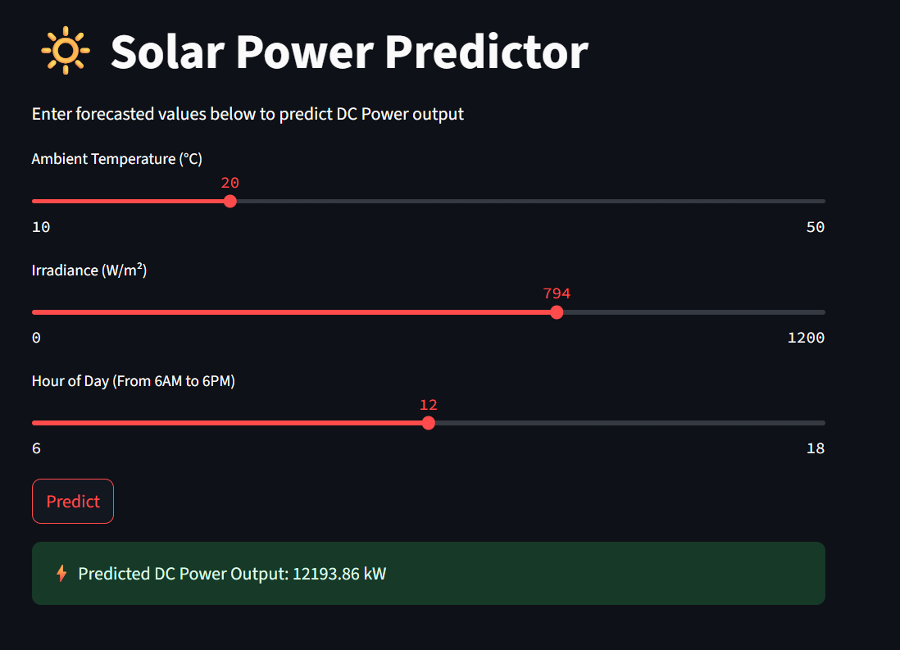

# ☀️ Solar Output Predictor

A Streamlit-based machine learning web app that predicts solar energy output using real-world weather sensor data (ambient temperature, solar radiation, wind speed, etc.).

---

## 🚀 Live App

👉 [Try the Solar Output Predictor](https://solar-prediction.streamlit.app/)

---

## 📊 Project Overview

This project leverages actual solar power plant data to:
- Analyze and visualize environmental and generation parameters
- Train a machine learning model to predict AC power output
- Deploy a user-friendly web app for real-time predictions

---

## 📁 Repository Structure

```
Solar-Output-Predictor-ML/
│
├── Solar-Predictor-App.py           # Streamlit web app source code
├── solar_model.pkl                  # Trained ML model
├── requirements.txt                 # Python dependencies
├── README.md                        # Project documentation
│
├── Data/
│   ├── Plant_1_Generation_Data.csv  # Raw generation data
│   └── Plant_1_Weather_Sensor_Data.csv # Raw weather sensor data
│
└── Notebooks/
    ├── 01-Data-Exploration-and-Pre-Processing.ipynb
    ├── 02-Model-Training-and-evaluation.ipynb
    ├── Merged_data.csv
    └── solar_model.pkl
```

---

## ⚙️ How to Run Locally

1. **Clone the repository:**
   ```
   git clone https://github.com/Ronny-Kimutai/Solar-Output-Predictor-ML.git
   cd Solar-Output-Predictor-ML
   ```

2. **Install dependencies:**
   ```
   pip install -r requirements.txt
   ```

3. **Start the Streamlit app:**
   ```
   streamlit run Solar-Predictor-App.py
   ```

---

## 📝 Notebooks

- `01-Data-Exploration-and-Pre-Processing.ipynb`: Data cleaning, merging, and exploratory analysis.
- `02-Model-Training-and-evaluation.ipynb`: Model training, evaluation, and saving the trained model.

---

## 📈 Data Sources

- `Data/Plant_1_Generation_Data.csv`: Solar plant generation records.
- `Data/Plant_1_Weather_Sensor_Data.csv`: Weather sensor measurements.

---

## 📷 Sample Visualizations

Below are some key visualizations and screenshots from the project:

### Model Performance


### Predicted vs Actual Solar Output


### Prediction Based on Weather Forecast


### Streamlit App Interface


---

## 🤝 Contributing

Contributions, issues, and feature requests are welcome! Feel free to open an issue or submit a pull request.

---

## 🔭 Future Work & Integration Possibilities

This project can be extended by incorporating Embedded Systems and IoT technologies to collect real-time data from weather sensors and solar panels. These devices can feed live data into the model for more accurate and responsive predictions.

Furthermore, Control Engineering principles can be integrated to create intelligent decision-making systems. For instance, if the model forecasts low solar output, the system could automatically trigger early battery pre-charging or load management routines to ensure uninterrupted power availability.

---

## 📄 License

This project is licensed under the MIT License.

---